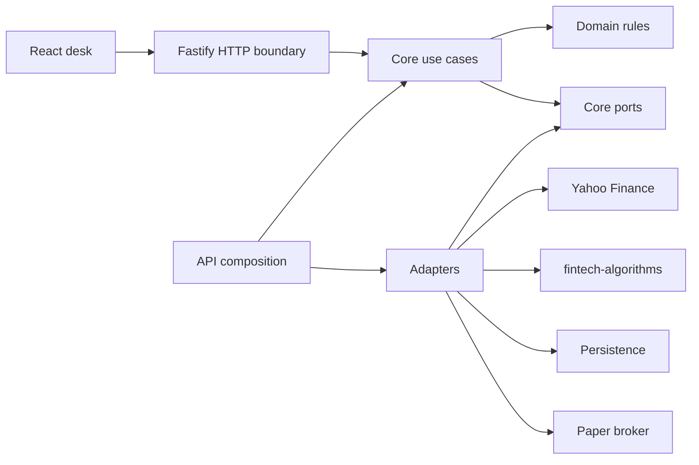

# Architecture and educational structure

## Design goal

Make every financial decision traceable from its input through a named rule to a visible result. A learner should be able to follow one request without understanding a large framework.

The initial teaching scope is long-only cash-funded equities and ETFs, daily observations, an explicit base currency, synthetic fixtures, and paper execution. Foreign listings, bond ETFs, and FX do not imply that direct bonds or derivatives are implemented.

## Dependency direction

An arrow into ports means the adapter implements the interface. Core never imports an adapter. Composition chooses implementations and injects them.

## Workspace responsibilities

| Workspace | Inputs and outputs                             | Allowed dependencies                                             |
| --------- | ---------------------------------------------- | ---------------------------------------------------------------- |
| api       | HTTP contracts to use-case outcomes            | core, contracts, adapters, Fastify                               |
| web       | API DTOs to React views                        | contracts, React, presentation libraries                         |
| contracts | Wire schemas and domain-independent event DTOs | schema tools selected in Chapter 1                               |
| core      | Domain records, policies, commands, results    | contracts where appropriate; no transport/provider clients       |
| adapters  | External data and algorithms to port contracts | core, contracts, Yahoo, fintech-algorithms, later storage driver |
| testing   | Synthetic inputs and independent oracles       | contracts; targeted helper dependencies as needed                |

Dependencies are added when a chapter introduces a real import. Private workspace names reserve the boundaries now. Do not add circular dependencies or import source files across workspace directories.

## One request, end to end

A request to evaluate a mandate enters the HTTP layer, passes schema validation, and becomes an application command. A core use case loads versioned policies through a repository port, evaluates domain constraints, and returns a typed result. HTTP serializes it. React presents the decision and reason codes. Chapter 1 teaches this path with synthetic inputs.

Later chapters use the same pattern for provider ingestion, valuations, proposed trades, and report snapshots. Avoid generic CRUD that hides financial invariants.

## Folder convention

Within core/domain, group by financial purpose: mandates, instruments, market-data, accounting, valuation, benchmarks, research, risk, construction, rebalancing, orders, settlement, performance, and reporting. Each chapter adds only the folders it needs.

Each domain module should explain its inputs, units, clocks, invariants, invalid states, and links to its PRP. Keep transport DTOs in contracts, financial behavior in core, and vendor representation in adapters.

## Persistence progression

Chapter 1 uses an explicit in-memory repository to teach dependency boundaries. It must say data is session-only. Chapter 5 introduces durable SQLite storage, transactions, migrations, replay, and immutable journal entries. Choose the exact storage library then against the supported Node runtime. PostgreSQL is a later adapter decision.

Do not claim durability, multi-user isolation, or production readiness for an in-memory implementation.

## Runtime progression

Chapter 1 adds API and Vite entry points, scripts, strict TypeScript validation, tests, and an accessible mandate screen. Chapter 2 adds Yahoo instrument discovery. Chapter 3 adds bars and their quality report. The foundation contains package/configuration files and documentation only.

Use a fake clock and stable synthetic IDs in tests. Use UTC instants plus the exchange's IANA timezone and explicit session dates; midnight UTC is not a universal session boundary.

## Client behavior

Each feature must define loading, empty, rejected, unavailable, stale, success, and partial-data states as applicable. Tables need keyboard access, clear labels, currency/units, source and as-of information. Charts must not bridge unknown intervals without a visible gap policy.

Browser state is presentation state. The authoritative portfolio state, validation, rounding, and financial calculations remain on the backend.

## Data modes

Synthetic mode is reproducible and network-free. Yahoo mode is opt-in, has cache/source timestamps, and can be unavailable. Failing live requests must not silently switch into synthetic data. A response always declares its mode.

## Evidence and provenance

Every analysis result identifies the dataset revision, policy/model revision, package versions, as-of time, knowledge cutoff, warnings, and verification status. A report consumes a frozen snapshot, not a set of unrelated live queries.

See [data model](data-model.md), [API conventions](api-conventions.md), and [package integration](fintech-algorithms-integration.md).
