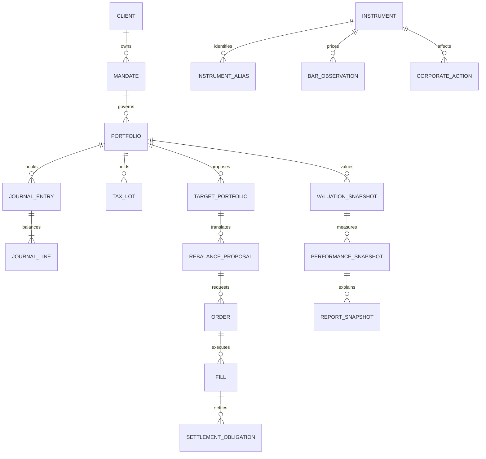

# Data model and schema blueprint

Status: design contract. No runtime schemas or database migrations are implemented. Chapters create versioned schemas with their behavior and tests.

## Universal conventions

| Concern             | Contract                                                                                                          |
| ------------------- | ----------------------------------------------------------------------------------------------------------------- |
| Identity            | Stable internal IDs; provider symbols are effective-dated aliases                                                 |
| Time                | UTC ISO instants; separate event/effective time, observation time, available/known time, and recorded time        |
| Sessions            | Exchange/calendar identifier, IANA timezone, session date, interval, and bar timestamp semantics                  |
| Money               | Decimal string plus currency; explicit rounding scale/mode at booking boundaries                                  |
| Quantities          | Decimal strings with instrument unit, lot size, and multiplier                                                    |
| Analytics           | Finite number arrays only at a checked conversion boundary; preserve time indexes and warm-up nulls               |
| Prices              | Currency, unit scale, source, price basis, observation time, quality state                                        |
| Missing values      | Explicit unavailable/invalid/unsupported reason; never zero by default                                            |
| Versions            | schemaVersion, policy/model versions, source revision, dataset revision                                           |
| Provenance          | Provider, requested symbol, returned symbol, request window, fetchedAt, source hash/reference, usage restrictions |
| Deletion/correction | Version or reversing event with author, reason, effective time, and recorded time                                 |

Chapter 5 selects bounded decimal strings, decimal.js 10.6.0 and Node 22.22 SQLite; see ADR 0004. Financial amounts must not be accumulated using uncontrolled binary floating point.

## Principal entities

| Entity               | Key relationships and required information                                                                       | First chapter |
| -------------------- | ---------------------------------------------------------------------------------------------------------------- | ------------- |
| ClientProfile        | clientId; goals, horizon, capacity, preferences; profile version                                                 | 1             |
| Mandate              | mandateId, clientId; effective interval, base currency, asset universe, cash floor and exposure constraints      | 1             |
| Portfolio            | portfolioId, mandateId; name, base currency, accounting policy version                                           | 1             |
| Instrument           | instrumentId; asset type, listing/venue, quote currency, scale, lot/tick evidence, lifecycle status              | 2             |
| InstrumentAlias      | instrumentId, provider, symbol, effectiveFrom/effectiveTo, knownAt                                               | 2             |
| MarketDataset        | datasetId/revision; provider request, instrumentId, interval, clocks, adjustment basis, lineage                  | 3             |
| BarObservation       | datasetId, instrumentId, session/interval timestamp; OHLCV, finality, quality state                              | 3             |
| ValidationFinding    | findingId, datasetId, row identity; severity, reason code, evidence, policy version                              | 3             |
| CorporateAction      | actionId, instrumentId; type, terms, effective and knowledge times, status and revisions                         | 4             |
| FxObservation        | pair direction, rate, source, observation/knowledge time, conversion policy                                      | 4             |
| Account              | accountId, portfolioId; account type, currency, owner, normal balance                                            | 5             |
| JournalEntry/Line    | entryId, eventId, portfolioId; postings, currency, idempotency key, reversal link                                | 5             |
| TaxLot               | lotId, instrumentId, portfolioId; acquiredAt, remaining quantity, basis, currency, policy                        | 5             |
| PositionSnapshot     | portfolioId, instrumentId, asOf; derived quantity, settled/unsettled split, source journal checkpoint            | 5             |
| ValuationSnapshot    | valuationId; holdings, prices, FX, accrued items, NAV, missing coverage, valuation policy                        | 6             |
| BenchmarkDefinition  | benchmarkId/revision; universe, weights, return/currency basis, rebalance schedule                               | 6             |
| ResearchObservation  | observationId; instrumentId, knownAt, inputs, method, uncertainty and limitations                                | 7             |
| RiskModelSnapshot    | modelId/revision; instrument order, return window, covariance, estimation method, diagnostics                    | 8             |
| TargetPortfolio      | targetId; mandate/model references, ordered weights, cash, feasibility and solver status                         | 9             |
| ValidationRun        | runId; dataset/model/strategy references, costs, decision and fill timing, fold results                          | 10            |
| RebalanceProposal    | proposalId; targetId, current checkpoint, lot choices, projected cash, costs, expiration                         | 11            |
| Order/Fill           | orderId, clientOrderId, proposalId; revisions, state, quantity, filled quantity, price/currency, paper/live mode | 12            |
| SettlementObligation | obligationId, fillId; settlement date/calendar, securities/cash legs, state, matching evidence                   | 13            |
| ReconciliationBreak  | breakId; source records, asOf, discrepancy, owner, action and resolution evidence                                | 13            |
| RiskFinding          | findingId; limit/policy revision, exposure, severity, state, acknowledgment history                              | 14            |
| PerformanceSnapshot  | measurementId; frozen valuations/flows/benchmark, return method, fee and FX treatment                            | 15            |
| AttributionResult    | measurementId; component effects, linking convention, residual and reconciliation evidence                       | 15            |
| ReportSnapshot       | reportId/revision; frozen inputs/results, asOf, scope, schema/method versions, approvals and supersession        | 16            |
| AuditEvent           | eventId; actor/action/resource, recordedAt, reason, previous/new revisions, correlationId                        | 1 onward      |

## Relations

## States and invariants

Instrument eligibility is contextual to a mandate and evaluation time. Discovery of a Yahoo symbol alone cannot mark it eligible.

Dataset quality is an explicit state: received, normalized, validated, accepted-with-limitations, quarantined, or rejected. A bar can be forming, closed, or of unknown finality; finality does not follow merely from its position in an array.

Journal entries are immutable after posting. A duplicate event/idempotency key cannot post twice. Corrections reverse and replace. Debits and credits balance per defined accounting currency policy; cross-currency events require explicit FX and clearing legs.

Position quantity must reconcile to journal/trade events and corporate actions. Cash available for an order differs from ledger cash because of reservations and settlement obligations.

Market-price history adjustment does not itself post a dividend or split to the book. Both flows reference the same corporate-action identity and cannot double count an entitlement.

A valuation may be incomplete. Missing prices, FX, or required entitlements produce coverage and reasons, never a false zero NAV.

Target weights obey the declared cash/gross/net convention. Infeasible, unbounded, unavailable, and non-converged optimizations cannot become executable proposals.

Fills cannot exceed the valid order quantity. Order acknowledgments, fills, and cancel events are idempotent and can arrive out of order. Settlement completion and fill completion are different states.

External contributions and withdrawals are distinct from income, fees, and trading P&L. Performance methods state exact cash-flow timing.

A frozen report references consistent snapshots. Later corrections produce a new revision while retaining the previously issued version.

## Worked accounting anchor to implement later

Synthetic base-USD opening cash: 10,000. Buy 10 shares at 100 and pay a 5 fee; ledger cash becomes 8,995 under a policy that expenses the fee. Mark the shares at 110: securities value 1,100 and NAV 10,095. A later external deposit of 500 makes NAV 10,595 but does not create investment profit. This is a teaching oracle for Chapters 5, 6, and 15, not an implemented calculation.

Cost basis and tax treatment may capitalize fees under a different named policy; do not silently mix that policy with this book P&L example.

## Acceptance for schema implementation

Each schema must reject invalid decimal encodings, unsupported currency/units, impossible intervals, unknown status transitions, and missing provenance needed by its use case. Preserve null reasons. Validate foreign references and uniqueness at the persistence boundary. Version a published wire contract when semantics change.
