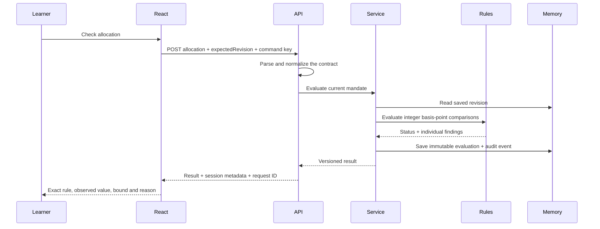

# Chapter 1 — Build the mandate lab

## What you will learn

Follow a candidate allocation from a React form through a typed HTTP request, a use case, a pure rule and a saved evaluation. The chapter answers: **What is this portfolio allowed to do, and how can we explain the answer?**

The implementation uses synthetic identities and weights. It does not retrieve market prices or recommend investments. The rules are authored teaching policies, frozen in the [definition contract](01-definition-contract.md).

## Run from a fresh checkout

Use Node 22.22.0 and npm 10.9.4, the verified runtime. From the repository root:

```bash
npm ci --ignore-scripts
npm run dev
```

Open <http://127.0.0.1:5173>. The API listens at <http://127.0.0.1:3100/api/v1/health>.

The development command builds workspace exports first, then runs TypeScript watch, the API watcher and Vite together. Stop with Ctrl+C. Restarting the API, including an API source edit under the watcher, clears every saved record. Browser reloads keep API records; select a saved portfolio to reopen its mandate. Candidate edits are browser state and are not restored by a reload.

No environment file is required. To change ports, copy `.env.example` to `.env` and set API_PORT, WEB_PORT and the matching WEB_ORIGIN. Keep the default loopback host for this chapter.

For a production-build preview, use separate terminals:

```bash
npm run build
npm run start:api
```

```bash
npm run preview --workspace @portfolio-atlas/web -- --port 5173
```

The preview uses the same local API and origin. This is a local teaching application; authentication and durable storage belong to later chapters.

## Try the complete journey

1. Keep the sample mandate: USD, five years, cash between 10% and 30%, position cap 40%, sector cap 50%.
2. Click **Create learning portfolio**. Observe the saved revision and session label.
3. Select **Concentrated**, then **Check allocation**. Aurora's 60% holding exceeds the 40% cap.
4. Select **Balanced** and check again. The 40% holding is accepted, as is cash exactly at the 10% floor.
5. Select **Low cash**. The total is still 100%, but cash is 5%; this is a policy breach.
6. Select **110% total**. The input is structurally invalid for an allocation; policy compliance is not meaningful yet.
7. Select **Missing sector**. The outcome is not evaluable. Unknown exposure is never converted into zero.
8. Change cash minimum to 35% while maximum stays 30%. Save the revision and evaluate: the policy itself conflicts.
9. Restore the minimum to 10%, save and evaluate Balanced. Open **Inspect evaluation provenance**.
10. Restart the API and use **Reload session**. The page explains the reset and the saved portfolio list is empty.

The five preset buttons change candidate inputs only. Every verdict comes from an actual API response. Editing inputs clears the previous verdict; unsaved mandate edits disable evaluation.

## Read the code in this order

| Step | File                                                                                                                                                                                                                        | Question it answers                                       |
| ---- | --------------------------------------------------------------------------------------------------------------------------------------------------------------------------------------------------------------------------- | --------------------------------------------------------- |
| 1    | [contracts/mandates.ts](../../packages/contracts/src/mandates.ts)                                                                                                                                                           | What is a valid wire value?                               |
| 2    | [synthetic fixtures](../../packages/testing/src/mandate-fixtures.ts)                                                                                                                                                        | What are our known examples?                              |
| 3    | [evaluate-mandate.ts](../../packages/core/src/domain/evaluate-mandate.ts)                                                                                                                                                   | Which declared rules pass, fail or remain unknown?        |
| 4    | [repository port](../../packages/core/src/ports/portfolio-repository.ts)                                                                                                                                                    | What does the application need from storage and time?     |
| 5    | [portfolio-service.ts](../../packages/core/src/use-cases/portfolio-service.ts)                                                                                                                                              | Which revision is evaluated, and is this a retry?         |
| 6    | [memory repository](../../packages/adapters/src/persistence/memory-portfolio-repository.ts)                                                                                                                                 | How are snapshots protected from later mutation?          |
| 7    | [composition](../../apps/api/src/app.ts) and [routes](../../apps/api/src/http/routes.ts)                                                                                                                                    | How do HTTP requests reach the rules?                     |
| 8    | [browser API client](../../apps/web/src/shared/api.ts)                                                                                                                                                                      | How are responses checked and network retries identified? |
| 9    | [React orchestration](../../apps/web/src/app/App.tsx)                                                                                                                                                                       | Which state belongs to the current screen?                |
| 10   | [mandate form](../../apps/web/src/features/mandates/MandateForm.tsx), [allocation editor](../../apps/web/src/features/mandates/AllocationEditor.tsx), [results](../../apps/web/src/features/mandates/EvaluationResults.tsx) | How does a person inspect the decision?                   |

The only runtime implementation in adapters is memory storage. Yahoo and algorithm integrations remain documented placeholders. The API imports the testing workspace intentionally to serve public synthetic lesson inputs.



## Small concepts with important consequences

- **Fractions on the wire:** 40% is 0.4. The editor converts percentage input at its boundary.
- **Exact comparison grid:** 0.4 becomes 4,000 basis points. Total allocation must equal 10,000. This is weight arithmetic, not a future monetary ledger implementation.
- **Two kinds of validation:** the HTTP schema rejects malformed values with 400; a successfully recorded evaluation can have an invalid, breached or not-evaluable result.
- **Versioned policy:** edits require expectedRevision. A stale command gets 409 instead of overwriting another edit.
- **Safe retries:** an idempotency key identifies one normalized command. Identical input replays the result; different input with the same key gets 409.
- **Time matters:** an allocation predating the current policy, or dated after evaluation time, cannot establish current-policy compliance. React obtains its synthetic snapshot time from the server.
- **Known breach plus unknown data:** a known breach remains a breach; the missing-sector finding remains visible.
- **Partial saves:** mandate and portfolio creation are two commands. If portfolio creation fails, the saved mandate remains visible and retry can finish the second command.
- **Currency consistency:** a mandate's base currency cannot change once a portfolio refers to it. Create another mandate for another base currency.
- **Memory is a teaching adapter:** synchronous commands are atomic within this single process. There is no durable transaction, cross-process coordination or per-user isolation.

## Verify the chapter

```bash
npm run check
npm run typecheck
npm run test:unit
npm run build
npx playwright install chromium
npm run test:browser
```

Unit tests cover contracts, independent expected rule outcomes and application state transitions. API tests use Fastify's real request injection, avoiding a network dependency. Browser tests launch the API on 3101 and Vite on 5174 and send real HTTP requests; keep those ports free.

The browser suite produces ignored `artifacts/chapter-1-desktop.png` and `artifacts/chapter-1-mobile.png`. Failures retain traces under `test-results`; `npx playwright show-report` opens the HTML report.

The production Vite build rejects backend, Yahoo and fintech-algorithms modules in the browser module graph.

## Replay the chronological history

Each commit is a usable teaching checkpoint. Use `git show <commit>` to inspect it without changing your checkout.

| Task | Commit                                 | Teaching checkpoint                                  |
| ---- | -------------------------------------- | ---------------------------------------------------- |
| 1    | 38fed56                                | Contracts, fractions, precision and fixtures         |
| 2    | fa35908                                | Runnable API and React workspace                     |
| 3    | edbfa14                                | Pure rules, use cases, revisions and memory adapter  |
| 4    | 0e39d6f                                | HTTP semantics, session metadata and audit           |
| 5    | 5e9e5b5                                | Connected React learning desk                        |
| 6    | Find `chapter-1 task-6` in Git history | Journey tests, recording notes, documentation and CI |

To replay a checkpoint in another checkout, use `git worktree add ../portfolio-atlas-replay <commit>`, then run `npm ci --ignore-scripts` there. Do not switch a dirty working directory backwards through the course.

## Next boundary

Chapter 1 is complete. Chapter 2 will verify instrument identity, provider symbol mapping and eligibility using Yahoo Finance v4. Candle validation follows in Chapter 3. D14 remains gated until the maintainer announces its package availability. Start the next chapter only when requested.
