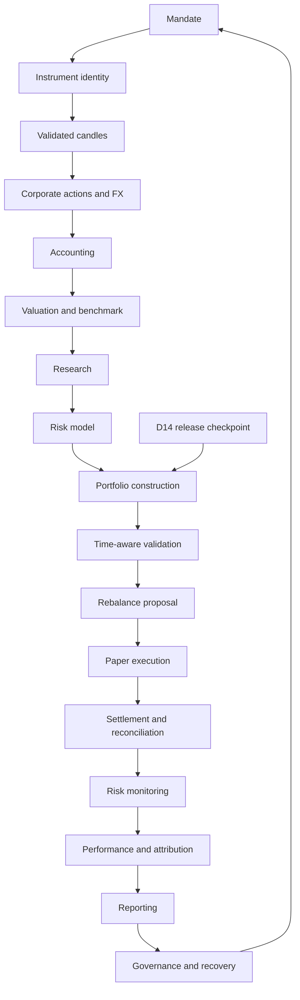

# Portfolio Atlas — Video series blueprint

Working title: **Build a Portfolio Manager with React, TypeScript and Yahoo Finance — From Market Data to Risk and Reporting**.

Repository: portfolio-atlas-fintech-portfolio-manager. Product name: Portfolio Atlas. Search terms belong naturally in the title, description, README and chapter labels; no promise of search ranking or traffic is made.

## Learning promise

Follow one portfolio from a client mandate through instrument identity, reliable prices, accounting, allocation, paper execution, reconciliation and a report whose figures can be traced to evidence.

Audience: developers building financial products and practitioners who want to understand the calculations and controls behind a management desk.

Prerequisites: JavaScript/TypeScript fundamentals, basic React, HTTP/JSON and introductory return arithmetic. Explain each financial prerequisite briefly when it enters the story; deeper topic articles are optional reading.

## Five acts

| Act                                | Chapters | Visible progress                                                       |
| ---------------------------------- | -------- | ---------------------------------------------------------------------- |
| Establish trustworthy inputs       | 0–4      | Mandate, resolved instruments, validated and comparable market data    |
| Build the book and decision inputs | 5–8      | Durable cash/positions, valuations, benchmark, research and risk model |
| Make and validate decisions        | 9–11     | Feasible target, honest backtest and practical rebalance               |
| Operate the portfolio              | 12–14    | Paper orders, settlement, reconciliation and risk alerts               |
| Explain and govern results         | 15–17    | Performance, attribution, reporting, approvals and recovery            |

## Dependency flow

The final arrow is the ongoing management cycle, not permission for an agent to implement unrequested chapters.

## Chapter outline

Times are editorial estimates, not implementation promises. The core totals roughly 385 minutes including a 10-minute opener, or about six to seven hours. It can be published as one chaptered long-form video or a connected playlist.

| Chapter                                              | Time   | Learner question                                                                  |
| ---------------------------------------------------- | ------ | --------------------------------------------------------------------------------- |
| 0 — Foundation                                       | 10 min | What will this system let us inspect and prove?                                   |
| 1 — Mandate and investable universe                  | 25 min | What is this portfolio allowed and expected to do?                                |
| 2 — Instrument identity and eligibility              | 20 min | Did we identify the actual security, listing, currency and trading unit?          |
| 3 — Market data ingestion and candle validation      | 25 min | Can these candles safely enter a calculation?                                     |
| 4 — Corporate actions, adjustment basis and FX       | 20 min | Was that price move economic, a corporate action, or a currency effect?           |
| 5 — Cash, positions, tax lots and the book of record | 30 min | Can every balance be rebuilt from the events that created it?                     |
| 6 — Valuation, NAV and an honest benchmark           | 20 min | What is the portfolio worth, and what is a fair comparison?                       |
| 7 — Research signals, fundamentals and evidence      | 20 min | What do we know about a holding, and when did we know it?                         |
| 8 — Expected returns, covariance and risk inputs     | 20 min | Which risks and input uncertainty will the allocation actually depend on?         |
| 9 — Portfolio construction and practical constraints | 30 min | Which feasible portfolio expresses the mandate under uncertain inputs?            |
| 10 — Time-aware backtesting and decision validation  | 25 min | Would this decision process survive information timing, costs and new periods?    |
| 11 — Rebalancing, cash flows and tax-lot policies    | 20 min | Which actual trades reach the target without violating cash and cost constraints? |
| 12 — Pre-trade controls and paper execution          | 25 min | What happens between an approved target and an actual fill?                       |
| 13 — Settlement, custody and reconciliation          | 20 min | Do our records agree with the broker and custodian?                               |
| 14 — Portfolio risk monitoring and actionable alerts | 15 min | What changed enough to require attention?                                         |
| 15 — Performance measurement and attribution         | 25 min | How much did we earn, and which decisions produced it?                            |
| 16 — Management insights and the reporting desk      | 20 min | Can a manager act on the report and trace every number?                           |
| 17 — Governance, access and recovery                 | 15 min | Can the system explain who changed a decision and recover a consistent book?      |

## One continuing teaching portfolio

Use synthetic internal IDs for two equities, a bond ETF and cash; add a second quote currency when Chapter 4 introduces FX. A bond ETF teaches listed-fund handling without implying direct-bond pricing support. Yahoo mode can use separately resolved public listings; it never replaces the synthetic oracle silently.

The recurring event deck includes: one mandate violation, ambiguous instrument identity, an impossible candle, a split, a dividend, a cash deposit, an optimization constraint, a late-data bias, a rounded trade that costs too much, a rejection, a partial fill, a settlement break, a risk breach and a report revision.

Create the fixtures when their chapters implement the relevant contracts. Record numbers and independent derivations then; screenshots must come from actual runs.

## Teaching pattern per chapter

1. Show the portfolio question and a concrete failure or decision.
2. Explain the financial rule using a small number of records.
3. Draw the input/output or state flow.
4. Implement one task, run its meaningful checks, commit.
5. Connect the React view to the backend result.
6. Inspect a bad input or exceptional state.
7. Prove the result against a worked example.
8. Recap the new capability and identify the next prerequisite.

## Visual and narration rules

Use tables and annotated state changes for ledgers, diagrams for identity/lineage, price-basis overlays for actions, heatmaps for covariance, feasible-set/weight comparisons for allocation, event timelines for leakage/orders, waterfalls for attribution, and drill-down for reports.

Speak topic names. Keep catalog IDs, dependency versions and tooling details in notes unless they matter to the engineering lesson. An on-screen number must name its input, time, unit and method where ambiguity matters.

Each chapter introduces a small set of ideas. Alternative indicators and specialist instruments use extension lessons rather than diluting the main story.

## Recording and completion

Use the [recording worksheet](chapter-recording-template.md) and [evidence template](chapter-evidence-template.md). Every finished chapter links the actual task commits and its verified screen. Re-record the opener using the final application only after it exists.
